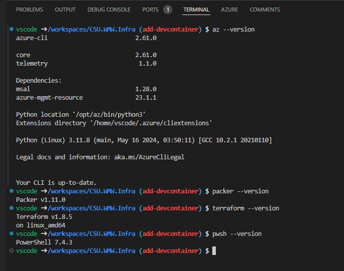

# Azure DevOps (WMW-MCAPS) Development Container

## What are Development Containers?

Development containers are a feature provided by Visual Studio Code, allowing you to define a container as a full-featured development environment. Using a `Dockerfile` and configuration files, you can set up your entire development environment, including all necessary tools, libraries, and extensions, within a Docker container. This ensures a consistent setup across different development machines and reduces the "it works on my machine" problem.

## Value Add of Using Development Containers

- **Consistency**: Every team member gets the same development environment, eliminating inconsistencies and setup issues.
- **Isolation**: Your development environment is isolated from your local machine, reducing the risk of conflicts.
- **Portability**: Easily switch between different development environments and share setups with your team.
- **Simplicity**: Setup new development environments quickly and efficiently using predefined configurations.
- **Customization**: Tailor the environment to include all necessary tools, extensions, and configurations for your project.

## Features

- **Dockerfile-based**: Uses a Dockerfile to define the development container.
- **Tool Customizations**: Pre-installed VS Code extensions for a seamless development experience.
- **Remote User**: Configured to connect as the `vscode` user.

## Getting Started

### Tools installed as part of the container



### Prerequisites

- Docker
- Git
- Visual Studio Code
- VS Code Remote - Containers extension

### Steps to Setup

1. **Clone the Repository**:

```sh
git clone git@github.com:mcaps-microsoft/CSU.WMW.Infra.git
cd CSU.WMW.Infra
```

2. **Open in VS Code**:
   Open the repository folder in Visual Studio Code.

3. **Reopen in Container**:
   - Press `F1` and select `Dev Containers: Reopen in Container`.

VS Code will now build the Docker image and set up the container based on the configuration in `.devcontainer.json`.

### .devcontainer.json

Here's the configuration used in `.devcontainer.json`:

```json
{
  "name": "Azure DevOps (WMW-MCAPS)",
  "build": {
    "dockerfile": "Dockerfile"
  },
  "overrideCommand": true,
  "customizations": {
    "vscode": {
      "extensions": [
        "4ops.terraform",
        "4ops.packer",
        "hashicorp.terraform",
        "ms-azuretools.vscode-azureterraform",
        "ms-vscode.powershell",
        "ms-vscode.azurecli",
        "ms-dotnettools.vscode-dotnet-runtime",
        "ms-azuretools.vscode-bicep",
        "ms-azuretools.vscode-docker",
        "github.codespaces",
        "github.copilot",
        "github.copilot-chat",
        "github.vscode-github-actions",
        "github.vscode-pull-request-github",
        "redhat.ansible"
      ]
    }
  },
  "remoteUser": "vscode"
}
```

### Extensions Included

- Terraform and Packer extensions by 4ops and HashiCorp
- Azure-related extensions for Terraform, PowerShell, Azure CLI, Bicep, and Docker
- GitHub integration extensions for Codespaces, Copilot, GitHub Actions, and pull requests
- Ansible extension by Red Hat

## Customizing the Container

To modify the development container setup:

1. **Edit the Dockerfile**:
   Customize the Dockerfile to install additional tools or dependencies.

2. **Update .devcontainer.json**:
   Adjust settings or add new VS Code extensions to the `customizations` section.

3. **Rebuild the Container**:
   After making changes, rebuild the container by selecting `Remote-Containers: Rebuild Container` from the command palette.

## Additional Resources

- [VS Code Remote Containers Documentation](https://code.visualstudio.com/docs/remote/containers)
- [Docker Documentation](https://docs.docker.com/)
- [Azure DevOps Documentation](https://docs.microsoft.com/en-us/azure/devops/)

## Support

For any issues or questions, please open an issue in this repository.

## Dockerfile

The following Dockerfile is used to set up the development environment within the container:

```dockerfile
FROM mcr.microsoft.com/devcontainers/base:bullseye

# Set the Arguments for the Dockerfile
ARG INSTALL_ZSH="true"
ARG UPGRADE_PACKAGES="false"
ARG PWSH_VERSION="v7.4.3"
ARG PWSH_FILENAME="powershell_7.4.3-1.deb_amd64.deb"
ARG USERNAME=vscode
ARG USER_UID=1000
ARG USER_GID=$USER_UID

# Install common-debian configs and dependencies
COPY library-scripts/*.sh library-scripts/*.env /tmp/library-scripts/
RUN apt-get update && export DEBIAN_FRONTEND=noninteractive \
    && /bin/bash /tmp/library-scripts/common-debian.sh "${INSTALL_ZSH}" "${USERNAME}" "${USER_UID}" "${USER_GID}" "${UPGRADE_PACKAGES}" "true" "true" 

# Install Powershell Core
RUN wget -q https://github.com/PowerShell/PowerShell/releases/download/${PWSH_VERSION}/${PWSH_FILENAME} \
    && sudo dpkg -i ${PWSH_FILENAME} \
    && apt-get update -y \
    && apt-get install -f \
    && rm -f ${PWSH_FILENAME}

# Install Azure Powershell Modules
RUN pwsh -c "Install-Module -Name Az -Force" \
    && pwsh -c "Install-Module -Name AzureAD -RequiredVersion 2.0.2.140 -Force" \
    && pwsh -c "Install-Module -Name Microsoft.Graph -Force" \
    && pwsh -c "Install-Module -Name powershell-yaml -Force"

# Install Azure Tools
RUN curl -sL https://aka.ms/InstallAzureCLIDeb | bash 

# Install Terraform & Packer
RUN wget -O- https://apt.releases.hashicorp.com/gpg | gpg --dearmor -o /usr/share/keyrings/hashicorp-archive-keyring.gpg \
    && echo "deb [signed-by=/usr/share/keyrings/hashicorp-archive-keyring.gpg] https://apt.releases.hashicorp.com $(lsb_release -cs) main" | tee /etc/apt/sources.list.d/hashicorp.list \
    && apt-get update \
    && apt-get install -y terraform packer \
    && terraform --version \
    && packer --version

# Install Ansible
RUN apt-get install -y ansible \
    && ansible-galaxy collection install azure.azcollection

# User Scope
USER ${USERNAME}
```

## Script Overview

The following script is called by the Dockerfile configuration. It sets up the development environment within the container:

```bash
#!/usr/bin/env bash
#-------------------------------------------------------------------------------------------------------------
# Copyright (c) Microsoft Corporation. All rights reserved.
# Licensed under the MIT License. See https://go.microsoft.com/fwlink/?linkid=2090316 for license information.
#-------------------------------------------------------------------------------------------------------------
#
# Docs: https://github.com/microsoft/vscode-dev-containers/blob/main/script-library/docs/common.md
# Maintainer: The VS Code and Codespaces Teams
#
# Syntax: ./common-debian.sh [install zsh flag] [username] [user UID] [user GID] [upgrade packages flag] [install Oh My Zsh! flag] [Add non-free packages]

set -e

INSTALL_ZSH=${1:-"true"}
USERNAME=${2:-"automatic"}
USER_UID=${3:-"automatic"}
USER_GID=${4:-"automatic"}
UPGRADE_PACKAGES=${5:-"true"}
INSTALL_OH_MYS=${6:-"true"}
SCRIPT_DIR="$(cd $(dirname "${BASH_SOURCE[0]}") && pwd)"
MARKER_FILE="/usr/local/etc/vscode-dev-containers/common"

if [ "$(id -u)" -ne 0 ]; then
    echo -e 'Script must be run as root. Use sudo, su, or add "USER root" to your Dockerfile before running this script.'
    exit 1
fi

# Ensure that login shells get the correct path if the user updated the PATH using ENV.
rm -f /etc/profile.d/00-restore-env.sh
echo "export PATH=${PATH//$(sh -lc 'echo $PATH')/\$PATH}" > /etc/profile.d/00-restore-env.sh
chmod +x /etc/profile.d/00-restore-env.sh

# If in automatic mode, determine if a user already exists, if not use vscode
if [ "${USERNAME}" = "auto" ] || [ "${USERNAME}" = "automatic" ]; then
    USERNAME=""
    POSSIBLE_USERS=("vscode" "node" "codespace" "$(awk -v val=1000 -F ":" '$3==val{print $1}' /etc/passwd)")
    for CURRENT_USER in ${POSSIBLE_USERS[@]}; do
        if id -u ${CURRENT_USER} > /dev/null 2>&1; then
            USERNAME=${CURRENT_USER}
            break
        fi
    done
    if [ "${USERNAME}" = "" ]; then
        USERNAME=vscode
    fi
elif [ "${USERNAME}" = "none" ]; then
    USERNAME=root
    USER_UID=0
    USER_GID=0
fi

# Load markers to see which steps have already run
if [ -f "${MARKER_FILE}" ]; then
    echo "Marker file found:"
    cat "${MARKER_FILE}"
    source "${MARKER_FILE}"
fi

